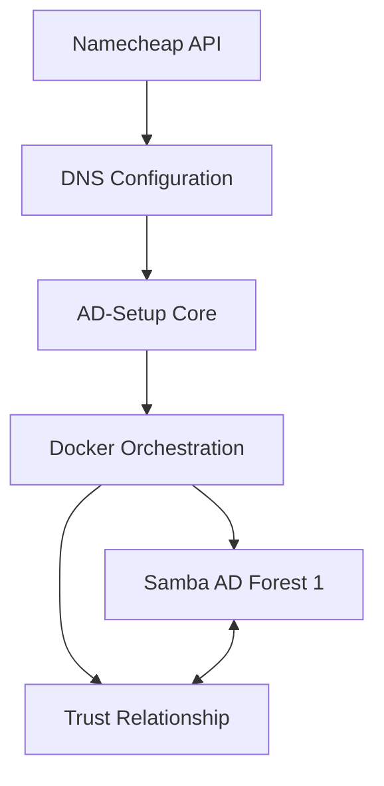

# AD-Setup Enterprise Edition 🌲

[](LICENSE)
[](https://hub.docker.com/)
[](https://github.com/features/actions)
[](docs/)

> **Enterprise-grade Active Directory automation solution** for deploying multi-forest Samba AD environments with automated trust relationships via Namecheap DNS integration.

## 🚀 Features

- **Automated Multi-Forest Deployment**: Deploy multiple AD forests with a single command
- **DNS Integration**: Seamless Namecheap API integration for FQDN management
- **Trust Relationships**: Automated forest trust establishment
- **Docker-Based**: Containerized deployment for consistency and scalability
- **Security First**: Built-in security best practices and compliance checks
- **Enterprise Ready**: Production-grade logging, monitoring, and error handling

## 📸 Screenshots

### Dashboard Overview

*Real-time monitoring of AD forest health and trust relationships*

### Deployment Wizard

*Intuitive step-by-step deployment process*

### Trust Management

*Visual representation of forest trust relationships*

## 🏗️ Architecture



## 📋 Prerequisites

### Linux
- Ubuntu 20.04+ or RHEL 8+
- Docker 20.10+ & Docker Compose 2.0+
- Python 3.8+
- Root access for installation

### macOS
- macOS 10.15 (Catalina) or later
- Docker Desktop for Mac
- Homebrew package manager
- Python 3.8+ (installed via Homebrew)

### All Platforms
- Namecheap API credentials
- Minimum 4GB RAM per AD forest
- Stable internet connection

## 🔧 Quick Start

```bash
# Clone the repository
git clone https://github.com/yourusername/ad-setup.git
cd ad-setup

# Run the installer
sudo ./scripts/install.sh

# Configure your environment
ad-setup configure

# Deploy your first forest
ad-setup deploy --forest primary.example.com
```

## 📚 Documentation

- [📖 Complete Documentation](https://yourusername.github.io/ad-setup/)
- [🏛️ Architecture Overview](docs/architecture/README.md)
- [🔌 API Reference](docs/api/README.md)
- [🚀 Deployment Guide](docs/deployment/README.md)
- [🔒 Security Best Practices](docs/security.md)
- [❓ FAQ](docs/faq.md)

## 💻 Usage Examples

### Basic Forest Deployment
```bash
ad-setup deploy \
  --forest corp.example.com \
  --admin-password "SecureP@ss123!" \
  --dns-provider namecheap
```

### Multi-Forest with Trust
```bash
ad-setup deploy-multi \
  --primary corp.example.com \
  --secondary dev.example.com \
  --trust-type bidirectional
```

### Advanced Configuration
```yaml
# config/forests.yaml
forests:
  primary:
    domain: corp.example.com
    dc_count: 2
    sites:
      - name: HQ
        subnet: 10.0.0.0/24
      - name: DR
        subnet: 10.1.0.0/24
  secondary:
    domain: dev.example.com
    trust_with: primary
```

See [examples/](examples/) for more configuration samples.

## 🧪 Testing

```bash
# Run unit tests
make test-unit

# Run integration tests
make test-integration

# Run security scan
make security-scan
```

## 🚢 Production Deployment

### Using Docker Compose
```bash
docker-compose -f docker-compose.prod.yml up -d
```

### Using Kubernetes
```bash
helm install ad-setup ./charts/ad-setup \
  --namespace active-directory \
  --values values.prod.yaml
```

## 🔐 Security Features

- Encrypted credential storage
- Automatic SSL/TLS certificate management
- Role-based access control (RBAC)
- Audit logging and compliance reporting
- Automated security updates

## 📊 Monitoring & Observability

- Prometheus metrics endpoint
- Grafana dashboard templates
- ELK stack integration
- Health check endpoints
- Performance metrics tracking

## 🤝 Contributing

We welcome contributions! Please see our [Contributing Guide](CONTRIBUTING.md) for details.

### Development Setup
```bash
# Clone and setup development environment
git clone https://github.com/yourusername/ad-setup.git
cd ad-setup
make dev-setup

# Run in development mode
make dev-run
```

## 🗺️ Roadmap

- [ ] Web UI for management
- [ ] AWS Route53 integration
- [ ] Terraform provider
- [ ] Ansible playbooks
- [ ] Multi-cloud support
- [ ] REST API v2

## 📝 License

This project is licensed under the GNU General Public License v3.0 - see the [LICENSE](LICENSE) file for details.

## 🙏 Acknowledgments

- Samba Team for the excellent AD implementation
- Namecheap for their robust API
- Our amazing community of contributors

## 📞 Support

- 📧 Email: support@ad-setup.io
- 💬 Slack: [Join our workspace](https://ad-setup.slack.com)
- 🐛 Issues: [GitHub Issues](https://github.com/yourusername/ad-setup/issues)
- 💼 Enterprise Support: [Contact Sales](https://ad-setup.io/enterprise)

---

<p align="center">
  Made with ❤️ by the AD-Setup Team
</p>
